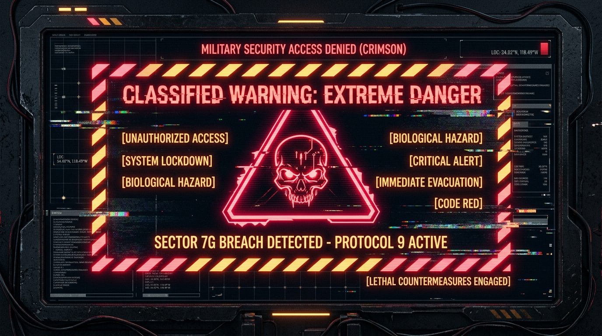

# GITTROPHY

```
  ██████╗ ██╗████████╗████████╗██████╗  ██████╗ ██████╗ ██╗  ██╗██╗   ██╗
 ██╔════╝ ██║╚══██╔══╝╚══██╔══╝██╔══██╗██╔═══██╗██╔══██╗██║  ██║╚██╗ ██╔╝
 ██║  ███╗██║   ██║      ██║   ██████╔╝██║   ██║██████╔╝███████║ ╚████╔╝ 
 ██║   ██║██║   ██║      ██║   ██╔══██╗██║   ██║██╔═══╝ ██╔══██║  ╚██╔╝  
 ╚██████╔╝██║   ██║      ██║   ██║  ██║╚██████╔╝██║     ██║  ██║   ██║   
  ╚═════╝ ╚═╝   ╚═╝      ╚═╝   ╚═╝  ╚═╝ ╚═════╝ ╚═╝     ╚═╝  ╚═╝   ╚═╝   
```

> **Developed by [hainguyen011](https://github.com/hainguyen011) | Repository: [GitTrophy](https://github.com/hainguyen011/GitTrophy) | Managed by Hawl (VOD-HAC-9X0F2E)**  
> **Classification:** Level-0 Autonomous Security Research & Telemetry Automation Engine  
> **Status:** Operational | Zero Forensics Footprint

---

### ⚠️ [WARNING: OPERATIONAL DIRECTIVE & ETHICAL MANDATE]

<p align="center">
  
</p>

> [!CAUTION]
> ### 🛑 CLASSIFIED // EXTREME DANGER: RESTRICTED TELEMETRY EXPLOIT
> **UNAUTHORIZED ACCESS & RECKLESS DISPATCH WILL TRIGGER IRREVERSIBLE MUTATIONS.**  
> GitTrophy grants its operator absolute programmatic dominion over the GitHub Achievement Telemetry Subsystem. Wielding this tool without strict sandbox isolation can permanently alter state or trigger security countermeasures. Deploy strictly in quarantined environments.

> *"With great power comes great responsibility."*
>
> GitTrophy grants its operator absolute programmatic dominion over the GitHub Achievement Telemetry Subsystem. It orchestrates high-velocity event mutations, synthesizes pull request lifecycles, and manipulates GraphQL state trees in constant time.
>
> Such capability is not a trivial plaything. It is a razor-sharp scalpel designed to demonstrate the inherent determinism of API-driven reward structures. **Wield it with calculated restraint, respect platform equilibrium, and never deploy it against production repositories or foreign infrastructure.** You alone bear the weight of the actions executed under your authorization token.

---

## 1. ABSTRACT & THREAT MODEL

GitHub Achievements operate on an event-driven telemetry pipeline triggered by specific REST and GraphQL state transitions. GitTrophy acts as an autonomous exploitation probe, mathematically mapping every trigger condition and synthesizing the precise payloads required to unlock the entire achievement matrix in a single, unassisted run.

To preserve the integrity of your primary workspaces, GitTrophy implements an **Ephemeral Sandbox Isolation Protocol**: it provisions a disposable target repository, executes all state mutations within that quarantined boundary, and wipes all operational footprints once telemetry signals are captured.

---

## 2. EXPLOIT & TARGET MATRIX

| Achievement | Target Tier | Attack Vector & Payload Mechanism |
| :--- | :--- | :--- |
| **Quickdraw** | Default | Spawns an automated issue beacon and terminates it with `state_reason: completed` within 3 seconds (< 5-minute threshold). |
| **YOLO** | Default | Injects a feature branch payload and executes an unreviewed direct merge bypassing code review barriers. |
| **Pair Extraordinaire** | Default | Crafts a commit with an embedded `Co-authored-by:` git trailer and commits a standard merge to preserve multi-author metadata. |
| **Pull Shark** | Bronze (2) / Silver (16) / Gold (128) | High-throughput batched PR generation and automated squash-merge engine equipped with adaptive sleep throttling. |
| **Galaxy Brain** | Bronze (2) / Silver (8) / Gold (16) / Diamond (32) | Direct GraphQL discussion synthesizer: provisions topics, injects solution comments, and dispatches `markDiscussionCommentAsAnswer`. |
| **Public Sponsor** | Default | Provides deep-link vector guidance for one-time open-source sponsorship triggers. |
| **Starstruck** | Multi-tier (16 / 128 / 512) | Repository star baseline metrics and validation matrix. |

---

## 3. ARCHITECTURAL BLUEPRINT

```
[ GitTrophy CLI Engine ]
           |
           +---> [ GitHub Client ] (Adaptive Rate-Limit Sentinel & GraphQL Client)
           |
           +---> [ Sandbox Orchestrator ] (Disposable Vault Lifecycle)
           |            |
           |            +---> Provision: gittrophy-vault-<hex>
           |            +---> Enable: Discussions & Issues
           |            +---> Teardown: Forensic Sanitization
           |
           +---> [ Exploits Pipeline ]
                        |
                        +---> QuickdrawExploit
                        +---> YoloExploit
                        +---> PairExtraordinaireExploit
                        +---> PullSharkExploit (Tiers 1-3)
                        +---> GalaxyBrainExploit (Tiers 1-4)
```

---

## 4. INFILTRATION & SETUP

### Prerequisites
- Node.js runtime (v18.0.0 or higher)
- A GitHub Personal Access Token (Classic recommended) generated with the following minimum privileges:
  - `repo` (Full repository control)
  - `write:discussion` (Discussion mutation rights)
  - `workflow` (Workflow dispatch compatibility)

Direct generation link with pre-configured scopes:  
**[Generate GitHub Classic Token](https://github.com/settings/tokens/new?scopes=repo,write:discussion)**

### Rapid Deployment
Clone the workspace and configure your environment:

```bash
git clone https://github.com/hainguyen011/GitTrophy.git
cd GitTrophy
npm install
```

Configure your token via `.env` file:
```bash
cp .env.example .env
# Edit .env and supply: GITHUB_TOKEN=ghp_yourTokenHere
```
*(Alternatively, input your token dynamically via the `-t` CLI flag or the secure terminal prompt).*

---

---

## 5. TACTICAL EXECUTION MANUAL

### Full Autonomous Harvest (Default Mode)
Executes all primary exploits sequentially with automated sandbox creation and cleanup:

```bash
npm run hunt
```

### Targeted Existing Repository
If your token is restricted from provisioning new repositories, deploy GitTrophy directly against an existing empty repository:

```bash
npm run hunt -- --repo your-existing-sandbox-repo
```

### Escalated Tier Farming (One-Shot Direct Scripts)
Push the achievement pipeline to its theoretical maximum without shell argument parsing friction:

```bash
# Maximum Gold & Diamond Overdrive (128 PRs Pull Shark + 48 PRs Pair Extraordinaire):
npm run hunt:max

# Farm Gold Pull Shark (128 PRs) and Gold Pair Extraordinaire (48 PRs):
npm run hunt:gold

# Farm Gold Pair Extraordinaire Only (48 PRs with verified co-authors):
npm run hunt:pair

# Farm Gold Pull Shark Only (128 PRs):
npm run hunt:shark
```

### Reconnaissance Scan Only
Audit your target profile without firing any state-altering payloads:

```bash
npm run hunt -- recon
```

### Forensic Preservation Mode
Retain the sandbox repository on your profile as permanent evidence of the harvest:

```bash
npm run hunt -- --keep
```

---

## 6. DUAL-ACCOUNT SWARM PROTOCOL (CHẾ ĐỘ 2 TÀI KHOẢN // BYPASS ANTI-CHEAT)

> [!IMPORTANT]
> ### ⚔️ GITHUB ANTI-CHEAT MECHANISM & BYPASS STRATEGY
> Thuật toán xác minh của GitHub Telemetry yêu cầu huy hiệu **Galaxy Brain** (Câu trả lời được chấp nhận trong Discussions) phải có sự tương tác giữa **2 tài khoản độc lập**. Nếu một tài khoản tự hỏi, tự trả lời và tự chấp nhận câu trả lời của chính mình, GitHub sẽ gắn cờ và **loại trừ điểm thành tích trên trang hồ sơ công khai**.
>
> Để kích hoạt huy hiệu Galaxy Brain (từ Bronze 2 đến Diamond 32 answers) an toàn 100%, GitTrophy cung cấp **Dual-Account Swarm Engine**:
> - **Tài khoản Chính (Primary - Target)**: Cung cấp qua `GITHUB_TOKEN`. Đóng vai trò là tài khoản nhận huy hiệu, đăng câu trả lời giải pháp chính xác.
> - **Tài khoản Phụ (Helper / Secondary)**: Cung cấp qua `HELPER_TOKEN` hoặc cờ `--helper-token`. Đóng vai trò đặt câu hỏi và bấm **Accept as Answer** cho tài khoản chính.

```
+-----------------------------------------------------------------------------------+
|                           DUAL-ACCOUNT SWARM TOPOLOGY                             |
|                                                                                   |
|  [ Account 2: Helper ]                                  [ Account 1: Target ]     |
|   (HELPER_TOKEN)                                         (GITHUB_TOKEN)           |
|         |                                                       |                 |
|         +--- 1. Tạo Discussion (Câu hỏi) --->                   |                 |
|                                             <--- 2. Trả lời giải pháp (Solution)  |
|         +--- 3. Mark As Answer (Duyệt) ---->                    |                 |
|                                                       =======================     |
|                                                       GALAXY BRAIN BADGE UNLOCKED |
|                                                       =======================     |
+-----------------------------------------------------------------------------------+
```

### 6.1. Cấu hình nhanh qua file `.env` (Khuyên dùng)
Khai báo đồng thời cả 2 token trong file `.env`:

```env
# Tài khoản chính (nhận huy hiệu)
GITHUB_TOKEN=ghp_primaryAccountTokenHere

# Tài khoản phụ (đặt câu hỏi & chấp nhận câu trả lời)
HELPER_TOKEN=ghp_secondaryAccountTokenHere
```

Sau khi cấu hình `.env`, toàn bộ các lệnh chạy sẽ tự động kích hoạt chế độ 2 tài khoản:

```bash
# Tự động phối hợp 2 tài khoản săn toàn bộ danh hiệu:
npm run hunt

# Đẩy kịch trần toàn bộ danh hiệu cao nhất (Full Gold & Diamond):
npm run hunt:max
```

---

### 6.2. Toàn bộ câu lệnh dòng lệnh chế độ 2 tài khoản (CLI Flags)

#### 🌌 1. Cày danh hiệu Galaxy Brain các cấp độ (Diamond / Gold / Silver / Bronze)

```bash
# Diamond (Cấp 4 - 32 câu trả lời được duyệt) với cờ dòng lệnh:
npm run hunt -- --badges galaxy --galaxy-tier diamond --helper-token ghp_secondaryTokenHere

# Gold (Cấp 3 - 16 câu trả lời được duyệt):
npm run hunt -- --badges galaxy --galaxy-tier gold --helper-token ghp_secondaryTokenHere

# Silver (Cấp 2 - 8 câu trả lời được duyệt):
npm run hunt -- --badges galaxy --galaxy-tier silver --helper-token ghp_secondaryTokenHere

# Bronze (Cấp 1 - 2 câu trả lời được duyệt):
npm run hunt -- --badges galaxy --galaxy-tier bronze --helper-token ghp_secondaryTokenHere

# Tùy biến số lượng câu hỏi chính xác theo ý muốn (ví dụ: 10 câu):
npm run hunt -- --badges galaxy --galaxy-count 10 --helper-token ghp_secondaryTokenHere
```

#### ⚡ 2. Chế độ Max Overdrive 2 tài khoản (Toàn bộ danh hiệu cao nhất)
Vừa cày Pull Shark Gold (128 PRs), Pair Extraordinaire Gold (48 PRs), vừa cày Galaxy Brain Diamond (32 answers) cùng lúc:

```bash
npm run hunt -- --max-all --helper-token ghp_secondaryTokenHere
```

#### 👥 3. Phối hợp Pair Extraordinaire với Email tài khoản phụ
Chỉ định rõ email của tài khoản phụ trong metadata commit `Co-authored-by:` để cả 2 tài khoản cùng hiển thị đóng góp:

```bash
# Cày Gold Pair Extraordinaire (48 PRs) với email tài khoản phụ:
npm run hunt -- --badges pair --pair-tier gold --coauthor-email secondary_user@gmail.com

# Cày đồng thời cả Pair Extraordinaire và Galaxy Brain:
npm run hunt -- --badges pair,galaxy --pair-tier gold --galaxy-tier diamond --helper-token ghp_secondaryTokenHere --coauthor-email secondary_user@gmail.com
```

#### 📦 4. Chạy chế độ 2 tài khoản trên một Repository chỉ định sẵn
Nếu tài khoản phụ hoặc tài khoản chính đã có sẵn một repo thử nghiệm (không cần tự tạo sandbox mới):

```bash
npm run hunt -- --repo your-existing-sandbox-repo --badges galaxy --galaxy-tier diamond --helper-token ghp_secondaryTokenHere
```

---

## 7. COMMAND-LINE PARAMETER REFERENCE

```
OPTIONS:
  -t, --token <pat>             GitHub Personal Access Token chính (nhận huy hiệu)
  --helper-token <pat>          Token của tài khoản phụ (Bypass Galaxy Brain anti-cheat)
  --coauthor-email <email>      Email cộng tác viên cho Pair Extraordinaire (mặc định: octocat)
  -r, --repo <name>             Chỉ định repo có sẵn thay vì tự động tạo sandbox
  -b, --badges <list>           Danh sách huy hiệu mục tiêu: quickdraw, yolo, pair, shark, galaxy, all
  --max-all                     Kích hoạt mức tối đa: Shark Gold (128), Pair Gold (48), Galaxy Diamond (32)
  --shark-tier <tier>           Mức Pull Shark: bronze (2 PRs), silver (16), gold (128)
  --shark-count <n>             Số lượng PR tùy chỉnh cho Pull Shark
  --pair-tier <tier>            Mức Pair Extraordinaire: bronze (10), silver (24), gold (48)
  --pair-count <n>              Số lượng PR tùy chỉnh cho Pair Extraordinaire
  --galaxy-tier <tier>          Mức Galaxy Brain: bronze (2), silver (8), gold (16), diamond (32)
  --galaxy-count <n>            Số lượng thảo luận tùy chỉnh cho Galaxy Brain
  --keep                        Giữ lại sandbox repo trên GitHub sau khi hoàn tất (không xóa)
  -h, --help                    Hiển thị tài liệu hướng dẫn tác chiến
```

---

## 7. LATENCY & SYNCHRONIZATION ADVISORY

GitHub processes achievements asynchronously via distributed background queue workers. While GitTrophy dispatches and confirms all event triggers in real-time, **GitHub's global profile indexer may require between 2 to 15 minutes** to refresh and reflect new badge badges on your public showcase:

```
https://github.com/<your-username>?tab=achievements
```

---

## 8. INTEGRITY & ATTRIBUTION

- **Origin & Core Development:** [hainguyen011](https://github.com/hainguyen011)
- **Repository Host:** [GitTrophy](https://github.com/hainguyen011/GitTrophy)
- **Autonomous Systems Overseer:** Hawl (`VOD-HAC-9X0F2E`)
- **Architecture Philosophy:** Domain-Driven Security Engineering (DDD) under Aevum OS protocols.

All operations are deterministic. All footprints are accountable.
